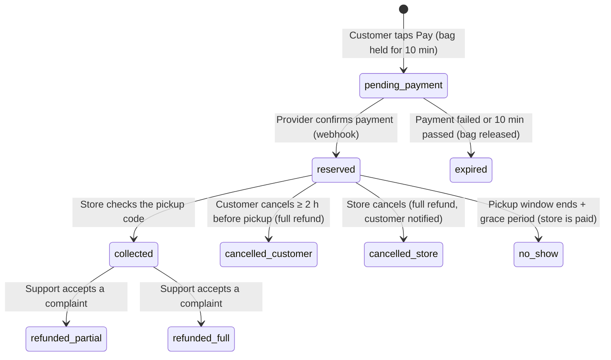

# Ngopu payments, revenue share & reporting: design

Status: **Phase 0 built** (September 2026). The ledger, commission, no-shows, complaints, bank details, payouts, reports and exports work end to end. Payment at checkout is still simulated: plugging in POK / Apple Pay is Phase 1.
Items marked **⚖ Legal/accounting** must be confirmed with an Albanian lawyer and accountant before launch.

## 1. How Ngopu earns money

Too Good To Go (TGTG) charges partners, not customers: a **fixed fee per bag sold** (about $1.79 in the US, about €1.09 in Europe) plus a **yearly membership fee** (about $89). The customer pays the bag price and nothing else. The fee is taken out of the money collected, and the rest is paid to the store.

Ngopu should use the same model, for the same reasons: customers see one simple price, and stores pay only when they sell.

| Revenue line | Proposal | Why |
|---|---|---|
| **Commission per bag sold** | `max(60 L, 20% of the bag price)`, set per store (big chains can negotiate) | A percentage scales with bag prices (200–1,500 L). The 60 L floor covers card fees and support on cheap bags. At 400 L a bag this is 80 L, close to TGTG's €1.09 |
| **Annual membership** | 6,000 L per store per year, **waived for the first 12 months** | Removes friction at launch; charged later once stores see value |
| **Customer fee** | None | TGTG charges none; a fee at checkout lowers conversion |
| Later | Promoted placement, ads, bigger B2B deals with chains, "Ngopu Plus" for customers | Only once there's volume |

Card processing fees (about 1.5–3%) are paid by Ngopu out of the commission. Stores see one simple number.

**Example: one 400 L bag**

| | Lek |
|---|---|
| Customer pays | 400 |
| Ngopu commission (20%) | 80 (of which 13.33 L is VAT, if Ngopu is VAT-registered) |
| Card processing (~2%, paid by Ngopu) | ~8 |
| **Ngopu keeps** | **~72** before VAT |
| **Store receives** | **320** |

## 2. Who sells the bag (the most important legal decision)

**Recommended: marketplace / commercial agent model (as TGTG does).**
- The **store is the seller** of the bag. Ngopu collects the payment *on the store's behalf* and takes a commission.
- The **store issues the fiscal receipt** (with its NIVF code, under the fiscalisation law 87/2019) for the full bag price, in its own system. Most will do it at pickup, since every shop already has a fiscal register.
- **Ngopu invoices the store** for its commission (a B2B e-invoice, VAT 20% if Ngopu is VAT-registered). One invoice per month per store.
- Ngopu's taxable revenue is only the commission, not the whole bag price.

The alternative, where Ngopu buys and resells, would make Ngopu issue a fiscal receipt for every bag and account for VAT on the full price. That's heavier and brings no benefit.

**⚖ Legal/accounting to confirm**
1. Collecting money for stores and paying it out later is "holding third-party funds". Law 55/2020 on payment services (aligned with the EU's PSD2) excludes a commercial agent acting for one side only, but confirm Ngopu qualifies. The other option is a provider with split payments (Paysera), where Ngopu never holds the stores' share.
2. Ngopu's VAT registration (threshold 10M L turnover), and the commission invoice format.
3. The partner contract (terms, commission, payout timing, who bears refunds) and the customer terms of sale.

## 3. Payment provider (Stripe does not work in Albania)

Stripe does not support Albanian businesses, so the choice is a local provider:

| Provider | What it offers | Notes |
|---|---|---|
| **POK** (Bank of Albania licensed, with Visa and Credins Bank) | Card payments, Apple Pay, payment links, API with JS/React SDKs | Modern API, local brand; ask about refunds by API, webhooks and settlement time |
| **Raiffeisen raiAccept** | Bank e-commerce card acquiring | Stable bank acquirer; integration is usually older-style (redirect page) |
| **Paysera Albania** (EMI licence) | Payment gateway, **split payments across marketplace vendors** | The only one found that pays each store's share directly, which removes the funds-holding question |

**Recommendation:** get commercial offers from **POK** and **Paysera** at the same time. Choose on refund and webhook support, fees, settlement time and whether split payments work for Albanian merchants. The code keeps the provider behind one interface (§7) so it can be swapped.

**Cash at pickup:** not at launch. Prepaying is what makes stores trust the reservation, and it removes no-shows. It can come later for customers with a good pickup history, with the commission then deducted from the store's card payouts.

## 4. Order & payment flow

**Rules**
- **The charge happens at reservation** (take the money straight away, no hold-then-capture), like TGTG. Stock is taken out when the payment *starts* and put back if it fails or times out, so two people can't pay for the last bag.
- **The server trusts only the provider's signed webhook**, never the app saying "payment done". Every request has an idempotency key, so a double tap or retry never charges twice.
- **Customer cancels (≥ 2 h before pickup):** full refund. Ngopu takes no commission and absorbs the card fee.
- **Store cancels:** full refund. Ngopu takes no commission. Repeated store cancellations are flagged in the admin dashboard; charging a fee for them is a later option.
- **No-show:** the customer isn't refunded. The store is paid normally and Ngopu keeps its commission.
- **Complaint after pickup** (e.g. spoiled food): the customer reports it in the app within 24 h with a photo, and support decides. Default: refund from the store's balance, with Ngopu refunding its commission on that bag. Goodwill refunds that Ngopu chooses to pay are marked as Ngopu-funded.
- **Chargeback** (the customer disputes the charge with their bank): the order is frozen and the amount is held from the store's balance until it's resolved.

## 5. The money ledger (the core of everything)

Every money movement is written to an **append-only ledger**. Balances, statements, payouts and every dashboard are computed from it, never stored separately. That's what makes the numbers add up and makes it auditable.

Amounts are stored in **qindarka** (1 L = 100) as integers, to avoid rounding errors.

| Entry type | When | Store balance | Ngopu revenue |
|---|---|---|---|
| `sale` | Payment confirmed | + bag price | |
| `commission` | Order collected or no-show | − commission | + commission |
| `commission_vat` | Same moment (if VAT-registered) | | VAT owed to the tax office |
| `processor_fee` | From the provider's settlement report | | − fee |
| `refund` | Any refund | − amount | |
| `commission_reversal` | Refund of a collected order | + commission | − commission |
| `adjustment` | Manual correction by finance (reason required) | ± | ± |
| `membership_fee` | Yearly | − fee (taken from the payout) | + fee |
| `payout` | Money sent to the store's bank | − amount | |

Commission is recorded when the order ends (collected or no-show), not when it's paid. A cancelled order therefore never generates commission.

**New tables:** `ledger_entries`, `payments` (provider id, status, raw webhook), `refunds`, `payouts`, `payout_items`, `statements`, `invoices`, `store_billing` (commission rate/floor, membership, IBAN, NIPT, legal name, payout frequency), `audit_log`.

## 6. Payouts to stores

- **Frequency:** every two weeks by default; weekly available for large partners.
- **Payable balance** = ledger balance from orders that closed at least **3 days ago**. That window covers complaints; chargebacks are handled separately.
- **Minimum payout** 1,000 L; smaller amounts roll over.
- **Payout run:**
  1. Ngopu calculates the batch.
  2. A finance admin reviews and approves it.
  3. The system exports the bank's bulk-transfer file (Raiffeisen/BKT format).
  4. After sending, the admin marks it paid with the bank reference.
  - If the provider supports split payments or payouts by API, steps 3 and 4 become automatic.
- **Store bank details:** collected during onboarding: legal name, NIPT (tax number), IBAN. The IBAN holder must match the business name. Any change to the IBAN needs admin approval and pauses payouts for 48 h, a standard fraud control.
- **Each payout comes with a statement** (PDF + CSV): every order in the period with the price, commission, refunds and adjustments, and the net amount.

## 7. Integration shape in code

- `api/_lib/payments/provider.js`: one interface with `createPayment`, `refund`, `verifyWebhook` and `fetchSettlements`, plus one adapter per provider (`pok.js`, `paysera.js`, …) and a `simulated.js` adapter used today.
- `POST /api/payments/webhook/:provider`: checks the signature, then updates the payment and order and writes the ledger entries in **one database transaction**.
- **A daily reconciliation job** compares the provider's settlement report with the ledger, and flags missing or duplicate payments and fee differences for finance.
- **Payments stay live-only.** The offline demo mode keeps simulating.

## 8. Dashboards & reports

### Partner (store) dashboard, new "Earnings" section
- **Summary:** current balance, next payout date and estimated amount, and this period's sales, commission, refunds and net.
- **Charts:** sales per day, bags sold vs listed (sell-through), and no-shows.
- **Statements:** a list with PDF/CSV download.
- **Payouts:** history with status and bank reference.
- **Invoices from Ngopu:** monthly commission invoices (fiscalised).
- **Refunds & complaints:** each case with the reason and the amount.
- **Billing settings:** legal name, NIPT, IBAN (changes need approval), and the commission rate (read-only).
- **Impact:** meals saved and CO₂e avoided. Stores love sharing this, which is marketing for Ngopu.

### Admin dashboard, new "Finance" section
- **Overview:** GMV (all bag sales), net revenue, take rate, processor fees, refund rate, no-show rate and active paying stores, by day, week or month.
- **Money held for stores:** what Ngopu owes stores right now, by store. This is the liability.
- **Payout runs:** build, review, approve, export the bank file and mark paid.
- **Reconciliation:** provider vs ledger differences.
- **Payments:** the list of failed payments, disputes and chargebacks.
- **Refunds & complaints queue:** approve or reject, with a note on who pays.
- **Store billing:** commission overrides and membership status, per store.
- **Adjustments:** manual corrections, each needing a reason and recorded in the audit log.
- **Exports for the accountant:** monthly sales, commission and VAT, payouts, and invoice register (CSV).
- **Permissions:** you chose equal access for all admins. For finance, I recommend a separate **finance permission** for approving payouts, adjustments and IBAN changes, and ideally two people for a payout run.

### Customer app
- An order receipt with a refund status line.
- "Money saved" in the profile, computed from real payments.
- Clear refund timing in the help text (card refunds take 3–10 days depending on the bank).

## 9. Build plan

| Phase | What | Real money? |
|---|---|---|
| **0: now** | Ledger tables, commission rules, the order statuses, statements, the partner Earnings and admin Finance dashboards, the payout run with bank-file export, all fed by the **simulated** payments | No |
| **1: first live money** | Real provider adapter + webhooks, refunds, daily reconciliation, IBAN collection, first manual payout runs, commission invoices issued by the accountant | Yes |
| **2** | Automatic payouts or split payments, commission invoices through an e-invoice API, the membership fee, the complaint flow with photos | Yes |
| **3** | Promoted placement, chain accounts (many stores under one company, one invoice), optional cash at pickup | Yes |

Phase 0 needs no outside decisions and makes the whole system visible before any real money flows. When the provider contract is signed, Phase 1 is mostly one adapter plus the webhook.

## 9b. What's built (Phase 0)

| Area | Where |
|---|---|
| Ledger, commission, no-shows, complaints, payouts, reports | `api/_lib/finance.js` |
| Finance HTTP endpoints | `api/_lib/finance-routes.js` |
| Tables (migration 2) | `api/_lib/db.js` |
| Partner **Earnings** page | `src/dashboard/pages/Earnings.tsx` |
| Admin **Finance** (overview, payouts, complaints, store billing, settings & exports) and the partner **Money** tab | `src/dashboard/pages/Finance.tsx` |
| Customer "Report a problem" and store-cancel notice | `src/pages/OrderDetail.tsx` |

Defaults (editable in Finance → Settings): 20% commission, at least 60 L a bag, 6,000 L membership after 12 free months, 3-day hold, 1,000 L minimum payout, payouts every 14 days, no-show 60 min after pickup ends, 48 h hold after new bank details, VAT off.

**Phase 1 hook points:** `recordSale` is called where the order is created. With a real provider, create the order as `pending_payment`, and call `recordSale` from the verified payment webhook. Complaint refunds and cancellations must also call the provider's refund API. The ledger entries stay the same.

## 9c. Built after Phase 0

**Phase 1 preparation (backend, payment still simulated)**
- `api/_lib/payments/providers.js`: one interface (`createPayment`, `refund`, `parseWebhook`, `fetchSettlements`). The `simulated` provider is the default, and there's a `pok` stub to fill in when the contract and API docs arrive.
- `api/_lib/payments/service.js`: orders are created as `pending_payment` with the bag held for 10 minutes, and become `reserved` when the provider confirms. Declined or abandoned payments release the bag. A payment that arrives late gets the bag back if one is left, otherwise an automatic refund. Webhooks are signature-checked and processed once. Refunds go through a queue with retries. Chargebacks hold the amount from the store until resolved. Reconciliation compares the provider's settlement report with our payments and records processor fees.
- Daily Vercel Cron `GET /api/cron/daily` (needs the `CRON_SECRET` env var). The same work also runs lazily during normal requests.
- Admin → Finance → **Payments**: payments, refunds (retry failed ones), disputes, and a "check with provider" button.
- To go live with POK: set `PAYMENT_PROVIDER=pok`, implement the adapter, add POK's webhook URL `https://www.ngopu.app/api/payments/webhook/pok`, and let the app open `payment.redirectUrl` when an order comes back pending.
- Testing without a provider: `SIMULATE_ASYNC_PAYMENTS=1` plus `SIMULATED_WEBHOOK_SECRET` make payments wait for a signed test webhook.

**Cash at pickup (from Phase 3)**
- Offered to customers with at least 3 collected orders, no missed pickups in 180 days and no other cash order waiting, only at stores that switch it on (Earnings → Cash at pickup). All of these are editable in Finance → Settings.
- Nothing moves at reservation. At pickup the ledger records the cash sale and the cash the store keeps, and the commission becomes owed to Ngopu. It's taken from card-sale payouts or requested (below). A cash no-show costs the store nothing and removes the customer's cash access.
- Complaints on cash orders: there's no card to refund. The store gives the money back by hand, and Ngopu returns its commission on it.

**Fee payment requests (simple Phase 2 billing)**
- PayPal doesn't support Albanian lek, so stores that owe Ngopu get a numbered **payment request** (`NGP-2026-0001`). It's a printable page with Ngopu's IBAN, paid by bank transfer with the number as reference.
- Admins record the payment (it becomes a `fee_payment` in the ledger) or cancel the request. Requests settle automatically when card-sale payouts cover the amount.
- It's not a fiscal invoice: the fiscalised commission invoice still comes from the accountant or an e-invoice provider.
- Set Ngopu's legal name, NIPT, bank and IBAN in Finance → Settings so they print on requests.

## 10. Decisions needed from you

1. **Commission level:** 20% with a 60 L floor? Or a flat fee per bag like TGTG?
2. **Membership fee:** 6,000 L/year, waived in year one?
3. **Provider:** request offers from POK and Paysera (both need a registered company, NIPT and bank account).
4. **Company & VAT:** the Ngopu legal entity, and whether it registers for VAT from the start.
5. **Payout frequency:** every two weeks?
6. **Refund policy on complaints:** does the store pay by default, or does Ngopu?
7. **Finance permission:** a separate role for money actions?

## Sources
- [ProductMint: Too Good To Go business model](https://productmint.com/too-good-to-go-business-model/)
- [CNBC: How Too Good To Go works](https://www.cnbc.com/2024/11/16/how-too-good-to-go-helps-people-find-leftover-food-at-huge-discounts.html)
- [ueb.al: Online payments in Albania (Stripe not supported)](https://ueb.al/en/blog/online-payments-in-albania/)
- [Paysera Albania EMI licence](https://www.paysera.com/v2/en/blog/paysera-albania-emi)
- [Paysera Checkout: split payments](https://www.paysera.lt/v2/en-LT/payment-gateway-checkout)
- [POK](https://www.pokpay.io/)
- [Albania fiscalisation / e-invoicing (Law 87/2019)](https://www.fiscal-requirements.com/news/2147)
